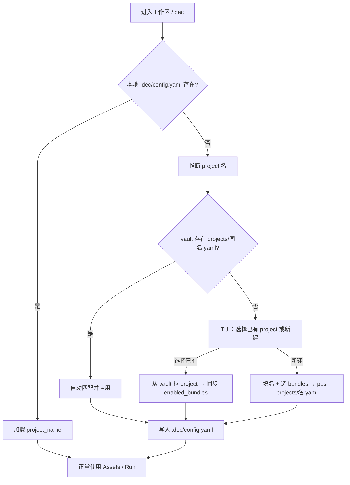

# Dec 架构设计

本文档描述 Dec 的实现结构与运行机制。

用户侧说明以以下文档为准：

- [README.md](../README.md)：项目概览与快速开始
- [BUNDLE-SECRETS-MODEL.md](./BUNDLE-SECRETS-MODEL.md)：Project / bundle 与 secrets bundle 同构模型
- [TUI_ARCHITECTURE.md](./TUI_ARCHITECTURE.md)：TUI 页面、测试策略与入口路由
- [schema/dec/v1/README.md](../schema/dec/v1/README.md)：Dec 配置 Protobuf schema
- [schema/secrets/v1/README.md](../schema/secrets/v1/README.md)：Secrets bundle Protobuf schema
- `internal/assets/dec/SKILL.md`：Dec Skill 的完整使用说明

## 概览

Dec 是一个以 **TUI** 为第一人机入口、以 **MCP** 为 Agent 入口的个人 AI 资产管理工具，用于把 Skills、Rules、MCP 配置保存在个人 Vault 中，并在不同项目、不同 IDE 间复用。

运行时采用「一机一服务、多门面」：

| 程序 | 职责 |
|------|------|
| `dec-server` | 本机单例；持有 `internal/app` 业务、Bitwarden 内存 session、project 写操作锁与进度广播 |
| `dec` | TUI 门面；无服务时自动拉起 `dec-server` |
| `dec-mcp` | Agent stdio MCP 门面；无服务时自动拉起 `dec-server` |
| `dec-exec` | 独立 env 注入程序；只读已落地 `.secrets/**/env/*.env`，不经过服务、不碰 session |

门面与服务通过仅绑定 `127.0.0.1` 的 gRPC 通信，端点与本机随机 token 写在 `~/.dec/run/server.json`。同一 project 的 pull/push 等写操作互斥；未发起操作的门面可旁观该 project 当前操作的实时进度。详见 [0008](decisions/0008-service-facade-split.md)。

配置与资产按 **Project > Bundle** 两层组织：

| 层级 | 存储位置 | 职责 |
|------|----------|------|
| **Project** | Git Vault `projects/<name>.yaml` | 声明项目启用哪些 bundle、默认 IDE 等；跨机器共享 |
| **Bundle** | Git Vault `bundles/<name>/` + Bitwarden secrets bundle | 公开资产与私密文件的同构组织单位 |

公开资产以 **bundle** 组织在 Git Vault，落地在 **`.dec/`**；私密文件以 **SyncTarget**（`.secrets/project/` 或 `.secrets/bundles/<name>/`）同构存放在 Bitwarden，SSH Key 落地 **机器级 `~/.ssh/`**。TUI **Run** 页一次 pull 先解析 project 的 bundle 列表，再逐 bundle 拉 Dec Git bundle、自动拉 secrets bundle，两边 **独立落地**（敏感文件不进 `.dec/cache/`），且 **`.dec/` 树与 `.secrets/` 树不得相交**。详见 [0002](decisions/0002-secrets-synctarget-root.md)。

用户操作通过 TUI Shell（`internal/tui/`）完成，业务逻辑在 `internal/app/`（仅 `dec-server` 内执行）：

- 仓库连接 / 本机 vars / 服务版本与重启：TUI **Settings** 页
- 项目初始化 / project 选择：TUI **Home**
- bundle 启用与资产浏览：TUI **Bundles** 页
- pull / push / remove（含成功对照后的孤儿 reconcile）：TUI **Run** 页
- 全量远端浏览 / temp 编辑 / 任意 folder 登记 / 远端与本地删除拆分：TUI **Remote** 页（ADR 0004）
- 版本信息：`dec --version`

资产目录类型（skill / command / rule / mcp）以 `internal/bundle.VaultAssetKinds` 为共用真相源。

## 文档边界

- `README.md` 负责概览、安装、快速上手
- `internal/assets/dec/SKILL.md` 负责完整的用户操作语义
- 本文档保留架构、目录结构、模块边界和关键运行机制

## 三层目录总览

```text
Git Vault（Dec 仓库）          Bitwarden                    本地工作区
─────────────────────          ─────────                    ──────────
projects/my-app.yaml           folder: vikunja（默认同名）     my-app/
  bundles: [vikunja]             Secure Note → .secrets/       ├── .dec/
bundles/vikunja/                 SSH Key → ~/.ssh/            │   ├── config.yaml  ← project_name
  skills/...                                                  │   └── cache/vikunja/
bundles/default/                                              ├── .secrets/bundles/vikunja/
                                                              │   └── env/vikunja.env
                                                              └── .cursor/...
                                                              └── .secrets/...
```

## Project 层

**Project** 是 Dec 的配置入口：用户只需在 project 里声明需要哪些 bundle，不必在每个工作区手工维护完整 bundle 列表。

### Vault 中的 Project 声明

```text
<repo>/
├── projects/
│   ├── my-app.yaml          # project 声明
│   └── dec-cli.yaml
└── bundles/
    ├── vikunja/
    │   ├── bundle.yaml      # bundle 成员声明（可选）
    │   ├── skills/
    │   ├── rules/
    │   ├── mcp/
    │   └── commands/
    └── default/
        ├── bundle.yaml
        └── skills/helloworld/...
```

`projects/<name>.yaml` 示例：

```yaml
name: my-app
description: 我的应用项目

bundles:
  - vikunja
  - helloworld

ides:
  - cursor

editor: code --wait
```

- `bundles`：启用的 Dec bundle 短名（对应 `bundles/<name>/`）
- `ides` / `editor`：该项目默认值；本地 `.dec/config.yaml` 可覆盖

### 本地 Project 引用

工作区 `.dec/config.yaml` 以 **`project_name`** 引用 vault 中的 project；bundle 列表从 vault project 同步到本地 `enabled_bundles`：

```yaml
version: v2

project_name: my-app

ides:               # 可选：机器级 IDE 覆盖
  - cursor

enabled_bundles:    # 从 projects/my-app.yaml 同步；Bundles 页可调整
  - vikunja
  - helloworld
```

`enabled_bundles` 是唯一的资产启用入口：成员资产随 bundle 一并解析下发，不能单独启用或排除。
早期版本的 `available` / `enabled` 字段已移除，`LoadProjectConfig` 读到旧配置时会把 `enabled` 涉及的 vault 折叠成 bundle 引用并立即回写，`available` 作为扫描缓存直接丢弃。

**职责划分**：

| 字段 | 存储 | 说明 |
|------|------|------|
| `project_name` | 本地 + vault 文件名 | 关联 `projects/<name>.yaml` |
| `bundles` | vault project | bundle 列表真相源 |
| `enabled_bundles` | 本地 | 从 vault 同步或 Bundles 页保存；pull 解析用 |
| `ides` / `editor` | vault project + 本地覆盖 | 本地优先 |

### Project 初始化（TUI-first）

首次进入工作区或 Home 页 **初始化 project** 时，TUI 引导完成以下之一：



1. **推断 project 名**：工作区目录 basename（如 `my-app`），或用户在 TUI 中指定
2. **自动匹配（新机器）**：vault 存在 `projects/<basename>.yaml` → 自动应用，写入本地 `project_name` 与 `enabled_bundles`
3. **选择已有 project**：从 vault 列出 `projects/*.yaml`，用户选择 → 同步 bundle 列表到本地
4. **新建 project**：填 project 名、勾选 bundles → **push 到 vault** `projects/<name>.yaml` → 写入本地引用

不在 TUI 外暴露 `dec init` 等 CLI 子命令；与 [TUI 优先](../.cursor/rules/tui-first.mdc) 一致。

## 目录结构

### Dec 根目录

```text
~/.dec/
├── config.yaml              # 全局配置（repo_url、默认 IDE、默认 editor）
├── local/
│   └── vars.yaml            # 本机级变量定义
├── repo.git/                # 本地 bare repo 缓存
└── secrets/
    ├── config.yaml          # Bitwarden 连接与 bundle ↔ folder 绑定
    └── device.json          # deviceIdentifier + 2FA remember 令牌（无密码、无 session）
```

secrets 没有本地同步状态文件：push 时**递归扫描** `.secrets/` 同步根；远端 note 列表用于 `MissingLocal` 报告。

若设置了 `DEC_HOME`，上述目录位于 `DEC_HOME` 下。

### 项目目录

```text
<workspace>/
├── .dec/
│   ├── config.yaml          # project_name + 本地 override + enabled_bundles
│   ├── cache/               # 资产缓存（pull 写入，push 读取）
│   ├── .version             # 最近一次 pull 的 commit 记录
│   ├── vars.yaml            # 项目变量定义（主文件，覆盖 vars.d/）
│   └── vars.d/              # 可选：拆分的变量片段 *.yaml / *.yml
├── .cursor/                 # IDE 渲染产物
└── .secrets/                # Bitwarden secrets 落地（须 .gitignore；不进 .dec/）
    ├── project/             # project 级 SyncTarget
    └── bundles/
        └── <name>/          # bundle 级 SyncTarget（如 env/*.env）
```

`.dec/` 适合纳入版本控制：

- `config.yaml`：`project_name`、机器级 IDE / editor 覆盖、`enabled_bundles`
- `cache/`：pull 下来的 **公开** 资产缓存，也是 push 的读取源（私密文件不进 cache）
- `.version`：当前项目最近一次 pull 对应的远端 commit
- `vars.yaml`：项目级变量与资产级变量覆盖

### 仓库中的 Vault 结构

远端仓库顶层仅含 **projects/** 与 **bundles/**：

```text
<repo>/
├── projects/
│   └── <project-name>.yaml   # Project 声明（bundles、ides、描述）
└── bundles/
    └── <bundle-name>/        # bundle 目录，名与 project.bundles 引用一致
        ├── bundle.yaml       # bundle 成员声明（可选；缺省时合成隐式 bundle）
        ├── skills/
        │   └── <name>/
        │       └── SKILL.md
        ├── rules/
        │   └── <name>.mdc
        ├── mcp/
        │   └── <name>.json
        └── commands/
            └── <name>/
                └── ...
```

Dec 通过扫描 `projects/` 与 `bundles/` 发现 project 与资产，不依赖额外索引文件。

### Bitwarden secrets bundle 结构

与 Dec bundle **同构绑定**；project 启用的每个 bundle 在 pull 时成对拉取 Dec + secrets。Secure Note **名称** = 相对 **SyncTarget.LocalRoot** 的路径：

```text
Bitwarden folder: vikunja（默认同 Dec bundle 名）

Secure Note: env/vikunja.env
  VIKUNJA_URL=https://vikunja.example.com
  VIKUNJA_API_TOKEN=...

Pull 后落地:
  <workspace>/.secrets/bundles/vikunja/env/vikunja.env   # 不进 .dec/
```

环境变量由独立 `dec-exec --bundle vikunja` 读取 `env/*.env` 注入子进程。

### SSH Key（机器级落地）

OpenSSH / Git 默认只认 **机器级** `~/.ssh/`，SSH 私钥 **不进项目根**（无 `keys/`、无项目级 `.ssh/config`）。

```text
Bitwarden folder: vikunja
  [SSH Key] deploy
    Name: deploy
    Notes: vikunja.example.com   # 可选；有内容时一行一个 host 或 host:port

Pull 后落地:
  ~/.ssh/dec_vikunja_deploy
  ~/.ssh/dec_vikunja_deploy.pub
  ~/.ssh/config                  # 有 hosts 时写入 Dec 管理区块（Host + IdentityFile）
```

- Notes 为空：只落私钥/公钥，不写 Host 配置、不报错。
- Notes 可为 `host` 或 `host:port`（如 `21.214.34.79:36000`）；有端口时写入 `Port`。
- Host 配置写入 `~/.ssh/config.d/dec.conf`，并在 `~/.ssh/config` **最顶部** `Include config.d/dec.conf`（OpenSSH 先匹配先生效，保证 Dec 注入优先）。
- `authorized_keys`：Dec 不管理（服务器侧自行维护）。
- `known_hosts`：Dec 不主动写入；首次连接由 OpenSSH 提示或由用户维护。
- 落地路径由 Bitwarden Item Name 推导（`~/.ssh/dec_<bundle>_<name>`），不记本地索引。

**`.dec/` 树** 与 **`.secrets/` 树** **不得相交**；冲突时 pull 报错。SSH 落在 `~/.ssh/`，不参与项目内零重叠校验。详见 [BUNDLE-SECRETS-MODEL.md](./BUNDLE-SECRETS-MODEL.md) 与 [0002](decisions/0002-secrets-synctarget-root.md)。

### 端到端示例：vikunja project

以下展示 vault 声明、Dec bundle 与 pull 后本地三处目录的关系。

**Vault — project 声明**（`projects/my-app.yaml`）：

```yaml
name: my-app
description: 使用 Vikunja 集成的应用
bundles:
  - vikunja
ides:
  - cursor
```

**Vault — Dec bundle**（`bundles/vikunja/`）：

```text
bundles/vikunja/
├── bundle.yaml
├── skills/vikunja-workflow/SKILL.md
├── rules/vikunja-integration.mdc
└── mcp/vikunja-mcp.json          # command: dec-exec，无 token 占位
```

**Bitwarden — secrets bundle**（folder `vikunja`，默认同 Dec bundle 名）：

```text
Secure Note: env/vikunja.env
  VIKUNJA_URL=https://vikunja.example.com
  VIKUNJA_API_TOKEN=...

[SSH Key] deploy  Notes: vikunja.example.com
```

**Pull 后本地目录**（存储根分离，零路径重叠）：

```text
my-app/
├── .dec/
│   ├── config.yaml               # project_name: my-app
│   └── cache/vikunja/            # Dec 公开资产（push 读取源）
│       ├── skills/...
│       ├── rules/...
│       └── mcp/vikunja-mcp.json
├── .cursor/                      # IDE 渲染产物（dec-* 前缀）
│   ├── skills/dec-vikunja-workflow/
│   ├── rules/dec-vikunja-integration.mdc
│   └── mcp.json                  # dec-vikunja-mcp 条目
└── .secrets/
    └── bundles/vikunja/
        └── env/vikunja.env       # Bitwarden Secure Note 落地

机器级（不进项目根）：
  ~/.ssh/dec_vikunja_deploy
  ~/.ssh/dec_vikunja_deploy.pub
  ~/.ssh/config                   # Dec 管理区块
```

### IDE 托管输出

| IDE | Skills | Rules | MCP |
|---|---|---|---|
| Cursor | `.cursor/skills/` | `.cursor/rules/` | `.cursor/mcp.json` |
| CodeBuddy | `.codebuddy/skills/` | `.codebuddy/rules/` | `.mcp.json` |
| Claude | `.claude/skills/` | `.claude/rules/` | `.claude/mcp.json` |
| Claude Internal | `.claude/skills/` | `.claude/rules/` | `.claude/mcp.json` |
| Codex | `.codex/skills/` | `.codex/rules/` | `.codex/config.toml` |
| Codex Internal | `.codex/skills/` | `.codex/rules/` | `.codex/config.toml` |

Dec 托管产物统一使用 `dec-` 前缀。`claude-internal` / `codex-internal` 在项目级复用 `.claude/` / `.codex/`；用户级目录分别为 `~/.claude-internal/` 与 `~/.codex-internal/`。

## 关键运行机制

### 1. 仓库连接与事务

TUI **Settings** 页连接远端仓库到本地 `repo.git` bare repo 缓存。

- 读操作基于 bare repo 的最新远端引用
- 写操作通过短生命周期临时 worktree 完成，结束后自动清理
- Dec 依赖系统 `git`，认证由用户 Git 环境负责

### 2. 有效 IDE 与编辑器解析

资产部署目标优先级：

1. 项目级 `.dec/config.yaml`（机器级 override）
2. vault `projects/<project_name>.yaml` 的 `ides` / `editor`
3. 全局 `~/.dec/config.yaml`
4. 默认值 `cursor`

交互式编辑器优先级相同。TUI **Settings** 页安装 Dec 内置资产并写入全局 IDE 列表。

### 3. 内置资产与 Vault 资产的边界

三套内容平面：

- **Dec 产品源码**：`internal/`、`cmd/`、`Documents/` 等，通过构建进入二进制
- **项目级落地产物**：`.dec/`、`.cursor/`、`.claude/` 等，由 TUI pull 写入
- **Vault 资产源**：远端 `projects/`、`projects/<name>.yaml` 与各 `bundles/<name>/` 目录与项目 `.dec/cache/`

修改 `internal/assets/` 走源码 commit + release；`.dec/cache/` 变更走 TUI **Run** 页 push；project 声明变更走 vault `projects/` push。

### 4. 资产生命周期

#### project init（Home / 首次进入）

- 推断或让用户指定 project 名
- 自动匹配 vault `projects/<name>.yaml`，或列出已有 project 供选择，或新建并 push
- 写入本地 `.dec/config.yaml`（`project_name`、`enabled_bundles`）
- 生成 `.dec/vars.yaml` 模板

#### bundle 选择（Bundles 页）

- 扫描远端 vault 与 bundle，列出全部 bundle 及成员
- 勾选保存后只写 `.dec/config.yaml` 的 `enabled_bundles`
- 保留已有 `project_name` / `ides` / `editor`

#### pull（Run 页）

1. 解析 `project_name` → vault `projects/<name>.yaml`（或使用本地 `enabled_bundles`）
2. 对每个 enabled bundle：拉 Dec Git bundle → `.dec/cache/<bundle>/`
3. 自动拉 Bitwarden secrets（各 SyncTarget）→ Secure Note **`.secrets/` 同步根**；SSH Key Item → **`~/.ssh/`** + Dec 管理 config 区块
4. 零重叠校验（`.dec/` vs `.secrets/`）
5. 从 cache 渲染安装到 IDE 目录 + 非敏感 vars 占位符替换
6. 记录 commit 到 `.dec/.version`

#### push（Run 页）

- 从 `.dec/cache/` 读取已启用资产，写回 Git Vault
- project 声明变更：更新 vault `projects/<name>.yaml`
- secrets bundle 走 Bitwarden API，不进 Git

#### remove（Run 页）

- 删除远端匹配资产，同步清理 `.dec/config.yaml` 与 `.dec/cache/`

### 5. MCP 合并策略

MCP 采用非覆盖式合并：

- Vault 条目以 `dec-{name}` 写入 IDE MCP 配置
- 用户非 `dec-*` 条目保持不变
- 不再托管的 `dec-*` 条目会被清理

### 6. freshness 被动检查

`internal/freshness/` 在后台检查远端 Vault 是否有新提交。实现位于 `internal/freshness/` 与 hidden 子命令 `__freshness-check`：

- 分离子进程执行 fetch，不阻塞 TUI 主流程
- cache：`~/.dec/local/freshness-result.<sha1>.json`，24h TTL
- lock：`~/.dec/local/freshness.lock`，busy 时静默 skip
- pull 成功后清 cache，避免误报

### 7. 变量替换

pull 后、从 cache 安装到 IDE 目录之后执行，仅作用于 **非敏感** 模板。优先级（由高到低）：

1. `.dec/vars.yaml` 中的 `assets.<type>.<name>.vars`
2. `.dec/vars.yaml` 中的 `vars`
3. `.dec/vars.d/*.yaml`（按文件名字典序合并；主文件覆盖同名键）
4. `~/.dec/local/vars.yaml` 中的 `vars`

私密 env（如 `VIKUNJA_API_TOKEN`）由独立 `dec-exec` 从 `.secrets/bundles/<name>/env/*.env` 注入子进程，**不通过**占位符替换注入。未定义占位符保留原样并通过 Reporter 提示。

## 模块划分

### `cmd/`

命令行入口层：

- `root.go`：根命令、TUI/CLI 分流、`dec --version`
- `freshness_check.go`：hidden 子命令，供 freshness 后台 worker 使用
- `output.go`：输出辅助

### `internal/app/`

用例层，编排 repo/config/ide 为可复用操作：

- `project.go`：project init、项目配置写入
- `overview.go`：TUI 首页概览
- `assets.go`：Bundles 页资产选择与持久化
- `operations.go`：pull/push/remove 编排
- `settings.go`：Settings 页仓库连接与全局配置
- `vault_bundle.go`：bundle 解析与合成
- `events.go`：`Reporter` / `OperationEvent` 事件模型

### `internal/tui/`

Bubble Tea 交互层：

- `app.go`：程序启动与 IO 绑定
- `model.go`：Shell model，Home / Assets / Project / Run / Settings 页

### `internal/config/`

- `global.go`：全局配置、有效 IDE / editor 解析
- `project.go`：项目级 `.dec/config.yaml` 与 `.dec/vars.yaml`

### `internal/repo/`

Git 仓库连接、bare repo 管理、事务 worktree。

### `internal/ide/`

IDE 抽象层，区分项目级输出目录与用户级内置资产安装目录。

### `internal/assets/`

内置 skill 内容（`dec`、`dec-extract-asset`），通过 embed 打包进二进制。

### `internal/types/`

全局配置、Project、ProjectConfig、资产列表、Bundle、MCP 配置等结构体。

### `internal/vars/`

变量文件加载、占位符提取与替换。

### `internal/version/`、`internal/update/`、`internal/freshness/`

版本信息、自更新、远端新鲜度检查。

## 关键设计点

### TUI 驱动

日常交互通过 TUI 页面完成；Agent / CI 调用 `internal/app/` API。

### Project > Bundle

- **Project**（vault `projects/`）：声明启用哪些 bundle，跨机器共享
- **Bundle**（`bundles/<name>/` + Bitwarden secrets bundle）：公开与私密资产的组织单位
- 本地 `.dec/config.yaml` 引用 project，同步 `enabled_bundles` 供 pull 解析

### 多 Bundle 支持

一个仓库可含多个 bundle；project 的 `bundles` 列表引用 bundle 短名。

### 托管范围有限

Dec 只管理 `dec-*` 产物，不修改用户手工维护的非托管内容。

### 基于文件系统的真实状态

Vault project 与 bundle 以目录和 YAML 文件直接组织，代码扫描真实目录发现状态。

### Secrets Bundle 同构

- 存储根分离：Dec → `.dec/`；Secure Note → `.secrets/`；SSH Key → `~/.ssh/`
- SyncTarget：Bitwarden folder ↔ `.secrets/project` 或 `.secrets/bundles/<name>/`；Note 名 = 相对同步根路径
- Pull：按 project bundle 列表 → Dec Git bundle → Bitwarden → 零重叠校验 → 独立落地 + IDE 渲染
- MCP 经独立 `dec-exec` 注入 `env/*.env`；不再依赖 mise 落地路径
- Schema：`Project`（`schema/dec/v1/projects.proto`）、`BundleBinding`、`SecretsConfig`（`schema/secrets/v1/`）
- TUI：Run 页一次 pull；Bundles 页选 bundle；Settings 页配置 Bitwarden

## 已知限制

### CodeBuddy MCP 路径

CodeBuddy MCP 位于项目根 `.mcp.json`。Codex 位于 `.codex/config.toml`。

### 文件权限

复制时使用固定权限位，不保留源文件权限。

### remove 按名称查找

多个 Vault 下存在同名同类型资产时，按仓库扫描顺序命中第一个。

### 测试覆盖

repo/ide 抽象与变量处理已有测试；部分 TUI 组合场景待补充。
