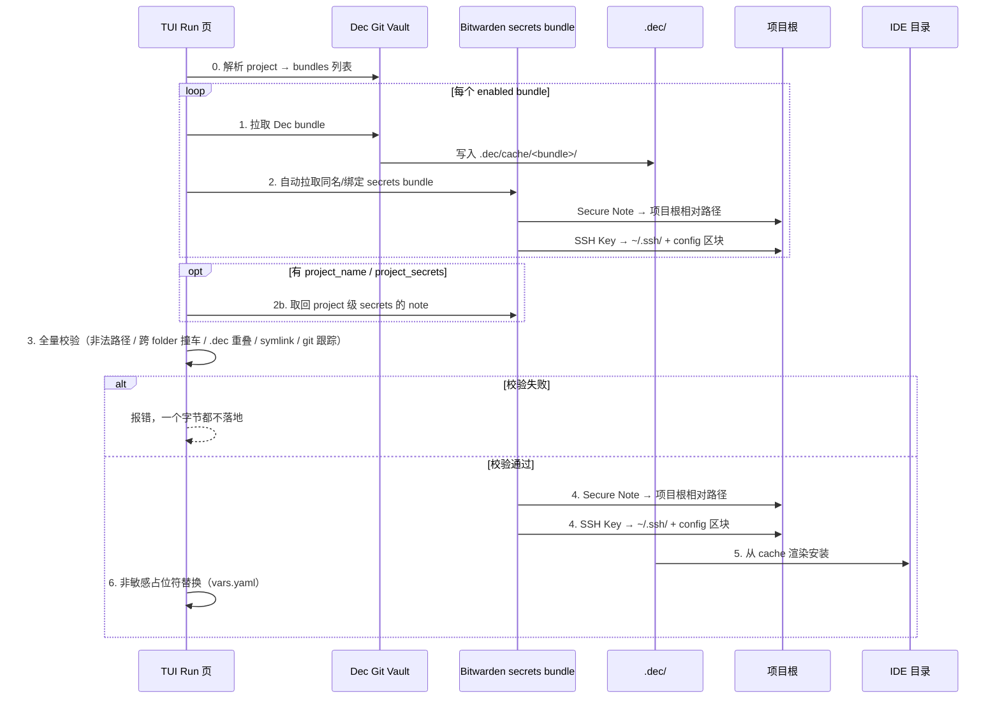
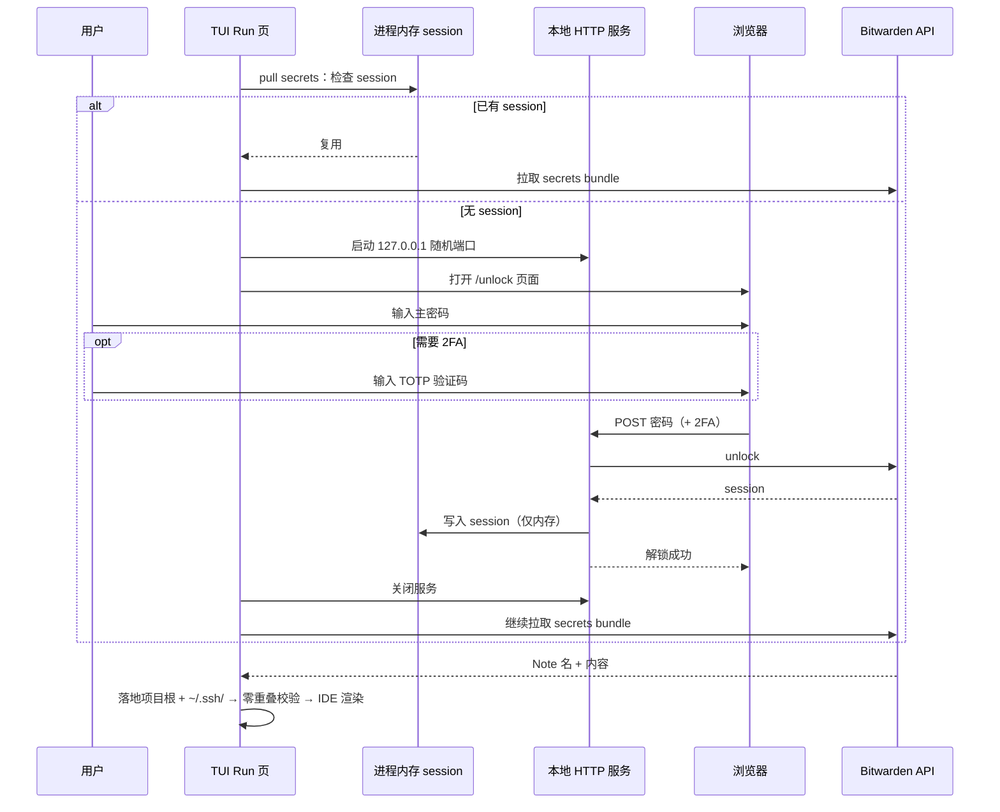

# Bundle 同构与 Secrets Bundle 模型

> 落地路径的决策依据见 [decisions/0001](decisions/0001-secrets-landing-path.md)：
> **Secure Note 名 = 该文件在项目根的目标相对路径，pull 原样落地**。

本文档描述 Dec **Project / bundle** 与 Bitwarden **secrets bundle** 的同构组织方式、存储根路径分离、拉取落地流程，以及零路径重叠 invariant。实现细节见 `Documents/ARCHITECTURE.md`；schema 声明见 `schema/dec/v1/` 与 `schema/secrets/v1/`。

## 一句话

Dec 以 **Project**（vault `projects/<name>.yaml`）声明启用哪些 **bundle**；公开 bundle 落地 **`.dec/`**，Bitwarden **同名 secrets bundle** 存放私密文件——Secure Note / mise env 落地 **项目根相对路径**，SSH Key 落地 **机器级 `~/.ssh/`**。两者 bundle 目录结构 **同构**，但 **存储根完全不同**；一次 TUI pull 按 project 的 bundle 列表分别写入各平面，**不合并进 `.dec/cache/`**，且 **`.dec/` 树与项目根敏感路径不得相交**。

## 存储根路径分离（核心）

| 平面 | 存储根 | 内容性质 | 组织单位 |
|------|--------|----------|----------|
| Dec Project 声明 | Git Vault **`projects/`** | 公开、可共享 | **project**（bundles 列表） |
| Dec（非敏感） | 项目 **`.dec/`** | 公开、可共享 | **bundle**（`bundles/<name>/`） |
| Bitwarden（敏感） | **项目根** 或 **`~/.ssh/`** | 全部私密 | **secrets bundle**（与 Dec bundle 同名/绑定） |

- **Project**：vault `projects/<name>.yaml` 声明 `bundles`；本地 `.dec/config.yaml` 以 `project_name` 引用
- **非敏感（Dec）**：仅在 `.dec/` 下（`cache/`、`config.yaml` 等）；渲染后部署到 IDE 目录如 `.cursor/`。
- **敏感（Bitwarden）**：Secure Note / mise env 等在项目根 **直接落地**，与 `.dec/` **完全不同的根**；**SSH Key 例外**，落地机器级 `~/.ssh/`（OpenSSH/Git 默认只认该路径，不进项目根）。
- 两者 **同构**（bundle 组织、子目录 + 文件），但 **存储根路径完全不同**。
- **零路径重叠**：`.dec/` 树与 **项目根** 敏感落地路径不得相交（SSH 在 `~/.ssh/`，不参与此项校验）。

```text
Git Vault                         本地工作区                         Bitwarden
─────────                         ──────────                         ─────────
projects/my-app.yaml              my-app/
  bundles: [vikunja]                ├── .dec/
                                    │   ├── config.yaml  project_name: my-app
bundles/vikunja/                    │   └── cache/vikunja/
  skills/...                        ├── .cursor/
                                    └── .config/mise/conf.d/vikunja.toml
                                        ↑ Bitwarden folder vikunja_workflow 的
                                          note ".config/mise/conf.d/vikunja.toml"
```

## Project 与 Bundle 的关系

```text
Project（projects/my-app.yaml）          Bundle（bundles/vikunja/）
──────────────────────────────          ─────────────────────────
name: my-app                              skills/vikunja-workflow/
bundles:                                  rules/vikunja-integration.mdc
  - vikunja          ──pull 时展开──►     mcp/vikunja-mcp.json
  - helloworld                            bundle.yaml（可选元数据）

Pull 顺序：
  1. 解析 project_name → projects/<name>.yaml → bundles 列表
  2. 对每个 bundle：Dec Git → .dec/cache/<bundle>/ + Bitwarden secrets → 项目根 / ~/.ssh/
```

- **Project** 只声明 bundle 短名；bundle 内资产结构在 `bundles/<name>/` 目录
- 本地 `enabled_bundles` 从 vault project 同步；Assets 页可微调后保存
- secrets bundle **仍与 Dec bundle 一一绑定**，不由 project 单独声明
- **project 级 secrets**（见下节）与 bundle 级并列，存放项目专属敏感文件

## Project 级 secrets

除 bundle 绑定的 secrets 外，每个 project 可有 **project 级** 敏感文件，与 Dec bundle 无关（如项目级 token、部署密钥）。

两级的差别**只在 Bitwarden folder 的来源**，落地规则完全一致：note 名即落地路径。
本地没有 `.secrets/` 这类分层目录——分组维度是 Bitwarden folder，不是本地文件系统。

```text
Bitwarden folder: vikunja_workflow      # bundle 级（随 enabled_bundles 同步）
  note ".config/mise/conf.d/vikunja.toml"  →  <project>/.config/mise/conf.d/vikunja.toml

Bitwarden folder: Dec                   # project 级（project_name 或 project_secrets）
  note "config/private.yaml"               →  <project>/config/private.yaml
```

| 维度 | bundle 级 | project 级 |
|------|-----------|------------|
| 触发条件 | `enabled_bundles` 中的 Dec bundle | 有 `project_name`（或目录 basename） |
| Bitwarden folder | `secrets_bundle`（默认同 Dec bundle 名） | `project_secrets`（默认同 `project_name`） |
| Secure Note 名 | 项目根相对落地路径 | 项目根相对落地路径 |
| 配置 | `bundles[].dec_bundle` / `secrets_bundle` | `~/.dec/secrets/config.yaml` 的 `project_secrets`（可选） |

`~/.dec/secrets/config.yaml` 示例：

```yaml
project_secrets: Dec   # 可选；未设时回退 .dec/config.yaml 的 project_name
bundles:
  - dec_bundle: vikunja
    secrets_bundle: vikunja_workflow
```

Pull / Push 的 secrets 阶段在遍历 bundle 之后，若解析到 project secrets 目标，会额外同步该 folder；零重叠校验同样覆盖这些路径。

**跨 folder 撞车**：两个 folder 各有一条同名 note 时，pull 在写盘前报错并中止——
两条不同的密钥抢同一个落地路径，无论落哪条都是错的，只能到 Bitwarden 里改掉其中一个 note 名。

## 组织形式

Dec Git Vault 与 Bitwarden secrets bundle 在 **bundle 内** 使用相同的相对目录约定（`skills/`、`rules/`、`mcp/` 等），但各自映射到 **不同的存储根**：

```text
Dec Git Vault（bundle: vikunja）
bundles/vikunja/
  skills/vikunja-workflow/SKILL.md
  mcp/vikunja-mcp.json             # command: mise，无 token 占位
  rules/vikunja-integration.mdc
  commands/...                     # 可选
  bundle.yaml                      # 可选

Bitwarden folder: vikunja_workflow（或绑定名 vikunja）
  Secure Note 名 = 项目内目标相对路径
  → .config/mise/conf.d/vikunja.toml
  内容为 TOML：
    [env]
    VIKUNJA_URL="..."
    VIKUNJA_API_TOKEN="..."
```

### Bitwarden Secure Note 命名

Bitwarden folder 名 = `secrets_bundle`（`BundleBinding` 可显式绑定，如 `vikunja` ↔ `vikunja_workflow`）。

- **Note 名称** = 该文件在**项目根的目标相对路径**（如 `.config/mise/conf.d/vikunja.toml`）。只有这一种合法形态。
- **Note 内容** = 该路径文件的完整正文（如 mise env TOML）。
- Pull 把 note 名当路径**原样落地**：不加前缀、不插 folder 名、不剥 `.config/`，**不经过 `.dec/cache/`**。
- Push（TUI Run 页 `O`）按**远端 folder 的 note 列表**去读本地对应路径并更新；不扫本地目录。
- 新增 secret 走 TUI Project 页 `A`（登记已存在的项目内文件），不由 push 隐式创建。

Note 名来自远端，按不可信输入处理：绝对路径、`~` 展开、`..` 逃逸、盘符一律拒绝，
落进 `.dec/` 或经符号链接逃出项目根同样拒绝。校验在写任何文件**之前**完成。

**为什么 push 不扫本地目录、也不删远端孤儿**：落地路径散在项目根，没有可靠的本地枚举方式。
权威索引只能是远端 folder 的 note 列表。本地缺文件时 push 只记进 `MissingLocal` 报告——
枚举漏一个就等于静默删掉一条真密钥；删除只走 Delete 页的逐条确认。

## MCP 与 mise

MCP 配置 **通过 mise 启动**；私密 env 由 mise 从项目根 `.config/mise/conf.d/*.toml` 读取，**不依赖** Dec 占位符替换注入 secret。

```json
{
  "command": "mise",
  "args": ["exec", "node@20", "--", "npx", "-y", "@shichao402/vikunja-mcp"]
}
```

- Dec Git 中的 `mcp/*.json` 只保留公开启动参数（`command`、`args` 等）。
- `VIKUNJA_URL`、`VIKUNJA_API_TOKEN` 等写在 Bitwarden Note 对应的 mise conf 文件中。
- **不需要** `{{TOKEN}}` 或 `${VIKUNJA_API_TOKEN}` 占位符替换作为 secrets 注入主路径；公开与私密从存储根上分离，是 Dec 内部应实现的事。

`{{VAR_NAME}}` 占位符仍可用于 `.dec/vars.yaml` 驱动的 **非敏感** 模板变量（项目名、URL 模板等），与 Bitwarden secrets 注入无关。

## SSH Key

OpenSSH、Git、`ssh`/`scp` 等工具默认只读取 **机器级** `~/.ssh/`，不认项目内路径。因此 SSH 私钥 **不进项目根**（无 `keys/` 目录、无项目级 `.ssh/config`），Pull 后落地到用户主目录 `~/.ssh/`。

### Bitwarden SSH Key Item

| 字段 | 含义 |
|------|------|
| **Name** | 逻辑名（如 `deploy`） |
| **Notes** | 关联 host，**可选**；有内容时**一行一个**（如 `vikunja.example.com`）。为空则只落密钥文件，不写 SSH config Host 条目 |
| 私钥 / 公钥 | Bitwarden SSH Key Item 自带字段 |

Item 存放在与 Dec bundle 绑定的 Bitwarden folder（如 `vikunja_workflow`）。

### Pull 落地

| 产物 | 路径 |
|------|------|
| 私钥 | `~/.ssh/dec_<bundle>_<name>` |
| 公钥 | `~/.ssh/dec_<bundle>_<name>.pub` |
| SSH config | `~/.ssh/config` 内 **Dec 管理区块**（`# BEGIN DEC MANAGED` … `# END DEC MANAGED`） |

若 Notes 声明了 host，Dec 管理区块按这些 host 写入 `Host` + `IdentityFile`，指向上述私钥路径；Notes 为空则只写密钥文件，不新增 Host 条目（也不使用 `Host *`）。`<bundle>` 为 Dec enabled bundle 名；`<name>` 为 Item Name。

私钥 / 公钥的机器级路径由 Bitwarden Item Name 与所属 bundle 推导（`~/.ssh/dec_<bundle>_<name>`），不记本地索引。

### 目录示例

```text
# Bitwarden folder: vikunja_workflow
[SSH Key] deploy  Notes: vikunja.example.com

# Pull 后机器级
~/.ssh/dec_vikunja_deploy
~/.ssh/dec_vikunja_deploy.pub
~/.ssh/config  # DEC MANAGED 区块

# 项目根（无 keys/）
my-app/.dec/...
my-app/.config/mise/conf.d/vikunja.toml
```

mise env 等 Secure Note 仍在项目 `.config/mise/conf.d/`，与 SSH 落地平面分离。

### authorized_keys / known_hosts

| 文件 | 策略 |
|------|------|
| `authorized_keys` | **Dec 不管理**；服务器侧由运维或部署流程自行维护 |
| `known_hosts` | **Dec 不主动写入**；首次连接由 OpenSSH 提示确认 host key，或由用户自行维护 |

## 零重叠 Invariant

校验对象是 **两个存储根下的路径集合**：

- `.dec/` 树内所有相对路径（含 `cache/`、`config.yaml` 等）
- 敏感文件在项目根的落地相对路径

规则：

- 上述两集合 **不得相交**。
- 若 pull 检测到交集，**必须报错并中止**，不得静默覆盖。
- 设计意图：公开与私密由 **存储根 + 路径** 分离保证，而非运行时覆盖或合并进 cache。

```text
错误示例（禁止）：
  Dec cache:  vikunja/mcp/vikunja-mcp.json
  Bitwarden:  vikunja/mcp/vikunja-mcp.json   ← 与 .dec/ 内路径冲突，pull 失败

正确示例：
  Dec cache:  vikunja/mcp/vikunja-mcp.json    → 渲染 .cursor/mcp.json
  Bitwarden:  .config/mise/conf.d/vikunja.toml → 项目根直接落地
```

## Pull 流程

用户在 TUI **Run** 页执行一次 **pull bundle**（或等价 API），内部顺序固定：



0. **Project 解析**：读取 `project_name` → vault `projects/<name>.yaml`，得到 `bundles`（或使用本地 `enabled_bundles`）
1. **Dec bundle**：对每个 bundle 从 Git Vault 拉取，写入 `.dec/cache/<bundle>/`
2. **取回 secrets note**：每个 Dec bundle 成功后 **自动** 从 Bitwarden 取回同名（或 `BundleBinding` 配置的）folder 下的 Secure Note，**先只取回不写盘**
2b. **Project secrets**：若有 `project_name`（及可选 `project_secrets` 配置），额外取回该 folder 的 note
3. **全量校验**：所有 folder 的落地路径**汇总后一次校验**——跨 folder 撞车只有在汇总视图下才看得见，逐 folder 边取边写会先写坏一半再报错
4. **落地**：Secure Note 按 note 名写到项目根相对路径；SSH Key Item 写到 `~/.ssh/` 并更新 Dec 管理 config 区块；敏感文件 **不合并** 进 `.dec/cache/`
5. **渲染安装**：从 `.dec/cache/` 安装到 IDE 目录
6. **占位符替换**：对非敏感模板执行 `vars.yaml` 替换（若有）

Pull **不做任何清理**：落地路径就是消费者路径，没有可以安全整棵删掉的目录。停用 bundle 后
已落地的密文件原样保留，删除走 Delete 页。

Push：Dec 公开资产走 Git push（源为 `.dec/cache/`）；secrets 走 Bitwarden API（按远端 note 列表读本地文件后 update），**不** 混入 Git Vault。

## TUI 用户体验

| 场景 | 用户操作 | 系统行为 |
|------|----------|----------|
| 首次进入工作区 | Home 初始化 project | 自动匹配或选择/新建 vault project，同步 bundles |
| 首次启用 bundle | Assets 页调整 bundle → Run 页 pull | 一次操作完成 project 内所有 Dec + secrets 双边拉取 |
| 仅更新公开资产 | Run 页 pull | 仍尝试同步 secrets bundle（幂等/增量） |
| 路径冲突 | Run 页 pull | 阶段日志标明冲突路径，整体失败，不部分安装 |
| Bitwarden 未配置 | Run 页 pull | 仅拉 Dec bundle；secrets 步骤跳过或 Settings 引导 |
| Secrets 管理 | Settings 页 | Bitwarden 连接、secrets bundle 命名绑定 |
| 新增一条 secret | Project 页 `A` | 输入项目根相对落地路径 → 选归属 folder → 创建 Secure Note |
| 删除 secret | Delete 页 | 按 Bitwarden folder 分组展示，逐条确认后删本地文件 + 远端 note |

不在 TUI 外暴露 `dec secrets pull` 等独立子命令；与 [TUI 优先](../.cursor/rules/tui-first.mdc) 一致。

## Bitwarden 认证

拉取 secrets bundle 需要有效的 Bitwarden session。认证由 **TUI 进程内** 触发，**无独立 CLI 子命令**。

### Session 存储

| 规则 | 说明 |
|------|------|
| 仅存进程内存 | Bitwarden session **仅在当前 Dec/TUI 进程内存** 中保存 |
| 禁止落盘 | **绝对不持久化**到磁盘；无 `~/.dec/secrets/session`、无 `BW_SESSION` 文件、无环境变量文件形式的 session 缓存 |
| 进程内复用 | 同一进程内已有有效 session 则直接复用，不重复弹窗 |
| 无缓存则阻塞 | 无 session 时阻塞等待用户完成 web unlock，成功后写入进程内存再继续 pull |

`~/.dec/secrets/` 下只有 `config.yaml`（连接与绑定）与 `device.json`（deviceIdentifier + 2FA remember 令牌），**都不含** 主密码、access token 或 session。

### Web Unlock 流程（唯一认证入口）

认证通过 **本地 HTTP 服务 + 浏览器网页** 完成，不由终端交互或 CLI 子命令承担：

1. TUI（或等价 `pkg/app` 调用方）在需要 Bitwarden API 时启动 **127.0.0.1 本地 HTTP 服务**（随机端口）。
2. **自动打开系统浏览器** 到本地解锁页。
3. 用户在网页输入 **Bitwarden 主密码** 并提交。
4. 若账户启用 **二次认证（2FA / TOTP）**，在同一网页继续输入验证码（无需切换终端）。
5. 认证成功后，session 写入 **进程内存**；HTTP 服务关闭；TUI 继续 secrets bundle pull 等后续步骤。

Settings 页可配置 Bitwarden 账户/组织等连接信息，但 **解锁动作** 仅在 pull（或其他需 API 的操作）缺 session 时由上述流程触发。

### 与 Pull 的衔接

TUI **Run** 页 pull bundle 时，Dec Git bundle 拉取完成后进入 secrets bundle 步骤；若进程内无 session，**自动**弹出 web unlock 并阻塞等待，解锁后将 Secure Note 落地到项目根、SSH Key 落地到 `~/.ssh/`，再执行零重叠校验与 IDE 渲染。



### 约束摘要

- **TUI-first**：认证由 TUI 进程触发 web unlock，不新增 `dec unlock` / `dec secrets login` 等子命令。
- **Web unlock 唯一入口**：禁止 session 文件持久化；禁止以 CLI 提示主密码替代网页流程。
- **按需解锁**：仅在需要 Bitwarden API 且进程内无 session 时阻塞等待；已解锁则透明复用。

详见 [ARCHITECTURE.md](./ARCHITECTURE.md) 与 [.cursor/rules/bitwarden-auth.mdc](../.cursor/rules/bitwarden-auth.mdc)。

## 无 legacy 路径兼容

**note 名只有一种合法形态**：项目根相对落地路径。没有前缀剥离、没有别名匹配、没有
`CanonicalNoteName` 这类归一化层——`findExistingCipher` 按 note 名精确匹配。

历史上曾并存 `mise/conf.d/x.toml`（裸相对路径）与 `.secrets/<bundle>/mise/conf.d/x.toml`
两种写法，靠一层前缀剥离把它们归一到同一个键。这层兼容是这套东西越来越乱的直接原因
（见 [decisions/0001](decisions/0001-secrets-landing-path.md)），已随一次性迁移删除。

`~/.dec/secrets/config.yaml` 废弃的 `folder:` 字段仍在加载时由 `normalizeBinding` 做内存兼容
（这是 config 字段名，与落地路径无关）。

## 配置与绑定

- **Project 声明**：vault `projects/<name>.yaml` 的 `bundles`；本地 `.dec/config.yaml` 的 `project_name` 引用
- **Dec bundle 启用**：本地 `enabled_bundles`（从 vault project 同步或 Assets 页保存）；secrets bundle 默认与 Dec bundle **同名**
- 显式绑定：`schema/secrets/v1/config.proto` 的 `BundleBinding`（`dec_bundle` ↔ `secrets_bundle`，后者即 Bitwarden folder 名）
- mise env 等私密配置：Bitwarden Secure Note，**Note 名 = 项目根相对落地路径**（如 `.config/mise/conf.d/vikunja.toml`），原样落地
- SSH Key：Bitwarden SSH Key Item，**Name = 逻辑名**，**Notes = hosts（可选）**；Pull 落地 `~/.ssh/dec_<bundle>_<name>`；有 hosts 时再更新 Dec 管理 `~/.ssh/config` 区块

## Schema

- Project 声明：`schema/dec/v1/projects.proto`（`Project`、`bundles`）
- Dec bundle 声明：`schema/dec/v1/assets.proto`（`Bundle`）
- 本地项目引用：`schema/dec/v1/config.proto`（`ProjectConfig`、`project_name`、`enabled_bundles`）
- Secrets 绑定：`schema/secrets/v1/config.proto`（`BundleBinding`）。**无同步状态 schema**——权威索引是远端 folder 的 note 列表，不落本地索引文件

## 相关文档

- [ARCHITECTURE.md](./ARCHITECTURE.md) — 模块划分、vault 结构与端到端 vikunja 示例
- [.cursor/rules/bitwarden-auth.mdc](../.cursor/rules/bitwarden-auth.mdc) — Bitwarden 认证约束（内存 session、web unlock）
- [.cursor/rules/bundle-secrets-mirror.mdc](../.cursor/rules/bundle-secrets-mirror.mdc) — 同构与存储根分离约束
- [schema/dec/v1/README.md](../schema/dec/v1/README.md) — Dec 配置 schema
- [schema/secrets/v1/README.md](../schema/secrets/v1/README.md) — Secrets bundle schema
