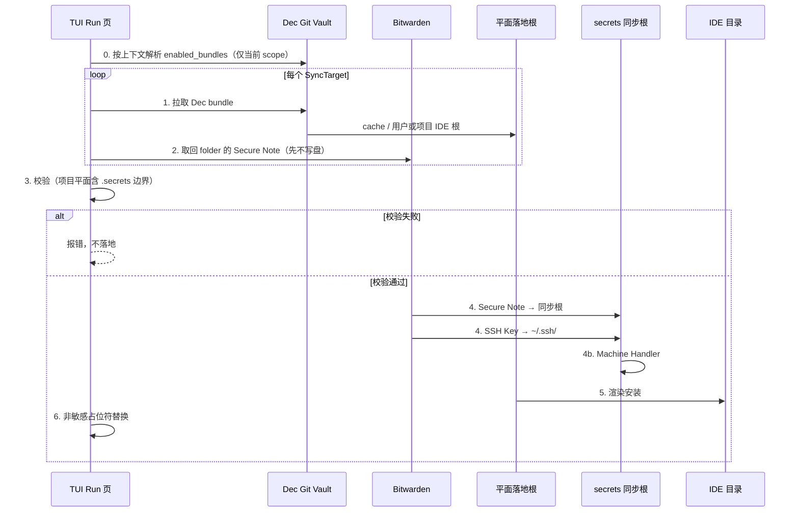

# P 四象限与 Secrets 模型

> 当前权威决策是 [ADR 0016](decisions/0016-p-four-quadrant-model.md)。它取代
> 0009、0013、0014 的 Project + Bundle 写模型；这些旧概念只保留在一次性迁移和 wire
> 兼容层中，不是新写入口。

本文档描述顶层 P、Git 四象限与 Bitwarden private secrets 的边界。实现细节见
`Documents/ARCHITECTURE.md`；schema 声明见 `schema/dec/v1/` 与 `schema/secrets/v1/`。

## 一句话

**可写对象只有 P**。Git 的 `public/private × user/project` 四象限全部只能放非敏感资产；
`private` 表示不可被其它 P 引用，并不表示可以把明文密钥提交到 Git。敏感正文只在
Bitwarden 的 `<p>/private/user` 或 `<p>/private/project`，分别落到
`~/.dec/secrets/<p>/` 与 `<project>/.secrets/<p>/`。

## 当前 P 模型（0016）

```text
Git Vault                         Bitwarden                     本地
<p>/                              folder <p>/private/user       user:
  dec.yaml                                                    ~/.dec/cache/<p>/...
  public/user/                                               ~/.dec/secrets/<p>/...
  public/project/
  private/user/                  folder <p>/private/project    project:
  private/project/                                           .dec/cache/<p>/...
                                                             .secrets/<p>/...
```

- P 名严格匹配 `^[a-z0-9]+(?:-[a-z0-9]+)*$`。
- 用户平面安装显式 `enabled_projects` 的 `public/user` 与 `private/user`。
- 项目平面安装家 P 的 `public/project` 与 `private/project`，再安装家 P
  `requires` 直接指向的 `public/project`。
- `requires` 不递归、不传递，不可引用 `public/user` 或任何 `private/*`。
- 同一平面多个 P 竞争同一个 IDE 目标路径时硬失败。
- 同一 P / plane / 相对路径不得同时由 Git private 象限和 Bitwarden 持有。
- Bitwarden Note 名是不可信的同步根相对路径；绝对路径、盘符、`~`、`..` 逃逸均拒绝。
- `private/project` 的 GCM 与 SSH 副作用定向到家工作区；`private/user` 保持机器级语义。

## 旧 Bundle 模型（仅迁移背景）

以下章节记录迁移输入及兼容协议。P 迁移完成后，普通 pull/push 不再双读旧
`projects/`、`bundles/` 或 `bundle/<name>` 结构。

## Bundle 二元 scope（0009）

`bundles/<name>/bundle.yaml` 声明 `scope: user | project`（必填）。判据是凭据归属：个人身份 → user；项目身份 → project。

| | user bundle | project bundle |
|--|-------------|----------------|
| skill / rule / command | `~/.cursor/skills/` 等 | `<project>/.cursor/skills/` |
| MCP | `~/.cursor/mcp.json` | `<project>/.cursor/mcp.json` |
| secrets | `~/.dec/secrets/bundles/<name>/` | `<project>/.secrets/bundles/<name>/` |
| 启用列表 | `~/.dec/config.yaml` 的 `enabled_bundles` | `<project>/.dec/config.yaml` 的 `enabled_bundles` |
| 管理入口 | `dec --user` | 普通 `dec`（项目工作区） |

平面隔离：user 上下文只看 user scope；project 上下文只看 project scope。Bitwarden session 与 `device.json` 共享。

## 存储根路径分离（核心）

| 平面 | 存储根 | 内容性质 | 组织单位 |
|------|--------|----------|----------|
| Dec Project 声明 | Git Vault **`projects/`** | 公开、可共享 | **project**（bundles 列表） |
| Dec（非敏感，project） | 项目 **`.dec/`** + 项目 IDE 目录 | 公开、可共享 | **bundle** |
| Dec（非敏感，user） | **`~/.dec/`** + 用户 IDE 目录 | 公开、本机 | **bundle** |
| Bitwarden（敏感，project） | 项目 **`.secrets/`** 或 **`~/.ssh/`** | 全部私密 | **SyncTarget** |
| Bitwarden（敏感，user） | **`~/.dec/secrets/`** 或 **`~/.ssh/`** | 全部私密 | **SyncTarget** |

- **零路径重叠**：项目内 `.dec/` 树与 `.secrets/` 树不得相交（SSH 在 `~/.ssh/`，不参与此项校验）。

```text
Git Vault                         本地工作区                         Bitwarden
─────────                         ──────────                         ─────────
projects/my-app.yaml              my-app/
  bundles: [vikunja]                ├── .dec/
                                    │   ├── config.yaml  project_name: my-app
bundles/vikunja/                    │   └── cache/vikunja/
  scope: project                    ├── .secrets/
  skills/...                        │   └── bundles/vikunja/
                                    │       └── .env/vikunja.env
bundles/tencent-cloud/              └── .cursor/
  scope: user
  skills/...                      ~/.cursor/skills/dec-tencent-cloud/
                                  ~/.dec/secrets/bundles/tencent-cloud/
                                  ~/.dec/config.yaml  enabled_bundles: [tencent-cloud]
```

## SyncTarget 模型

**SyncTarget** 是一次 secrets 同步的单位：

```text
SyncTarget{kind: bundle, name: vikunja, plane: project}
  folder: bundle/vikunja
  LocalRoot: .secrets/bundles/vikunja
  note ".env/vikunja.env" → <project>/.secrets/bundles/vikunja/.env/vikunja.env

SyncTarget{kind: bundle, name: tencent-cloud, plane: machine}
  folder: bundle/tencent-cloud
  LocalRoot: bundles/tencent-cloud（相对 ~/.dec/secrets）
  note ".env/x.env" → ~/.dec/secrets/bundles/tencent-cloud/.env/x.env
```

- **Bitwarden folder** 默认严格同名；显式别名见 `BundleBinding`。
- **Note 名** = 相对 `SyncTarget.LocalRoot` 的路径。**无** `bundles/<name>/` overlay 前缀协议（0009 删除）。
- **`.secrets/` 整树**（项目平面）必须被 `.gitignore` 忽略；已被 git 跟踪则 pull/push **硬失败**。用户平面跳过 gitignore / git 跟踪校验。

## Project 与 Bundle 的关系

```text
Project（projects/my-app.yaml）          Bundle（bundles/vikunja/）
──────────────────────────────          ─────────────────────────
name: my-app                              scope: project
bundles:                                  skills/vikunja-workflow/
  - vikunja          ──pull 时展开──►     rules/vikunja-integration.mdc
  - my-app                                mcp/vikunja-mcp.json
                                          bundle.yaml
                                          （私密半边可选）bundle/vikunja

Pull（project 上下文）：
  1. 解析 enabled_bundles（仅 scope: project）
  2. Dec Git → 项目 .dec/cache + IDE；Bitwarden → .secrets/bundles/<bundle>/

Pull（dec --user）：
  1. 解析 ~/.dec/config.yaml 的 enabled_bundles（仅 scope: user）
  2. Dec Git → 用户 IDE 目录；Bitwarden → ~/.dec/secrets/bundles/<bundle>/
```

- secrets bundle **仍与 Dec bundle 一一绑定**。
- **项目专属密文件** = 某个 `scope: project` 的 Bundle（常与项目同名），由 `projects/*.yaml` 引用；**不再**有裸 project folder 可写归属（ADR 0014）。

## Bundle 私密半边落盘

| 维度 | bundle 级（project scope） | bundle 级（user scope） |
|------|---------------------------|------------------------|
| 触发条件 | 项目 `enabled_bundles` | `~/.dec/config.yaml` 的 `enabled_bundles` |
| Bitwarden folder | `bundle/<name>` | `bundle/<name>` |
| 本地同步根 | `.secrets/bundles/<bundle>/` | `~/.dec/secrets/bundles/<bundle>/` |
| SSH Key | 一律 `~/.ssh/` | 一律 `~/.ssh/` |

`known_secret_bundles` 仍是本机发现缓存，落在 `~/.dec/secrets/config.yaml`，**不等于**启用；禁止任何启用语义（ADR 0014）。

`~/.dec/config.yaml` 示例（启用列表）：

```yaml
repo_url: git@github.com:me/dec.git
ides:
  - cursor
enabled_bundles:
  - tencent-cloud
  - woa
```

`~/.dec/secrets/config.yaml` 示例（仅 secrets 职责）：

```yaml
bundles:
  - dec_bundle: vikunja
    secrets_bundle: custom_alias
known_secret_bundles:
  - woa
```

存量 `.secrets/project/` 与裸 project folder 用 `MigrateProjectSecretsToBundle` 迁入 `bundle/<project_name>`。

**跨 folder 撞车**：两个 folder 的 note 汇总后映射到同一落地路径时，pull 在写盘前报错并中止。

## 组织形式

```text
Dec Git Vault（bundle: vikunja）
bundles/vikunja/
  bundle.yaml          # scope: project
  skills/vikunja-workflow/SKILL.md
  mcp/vikunja-mcp.json
  rules/vikunja-integration.mdc

Bitwarden folder: bundle/vikunja
  Secure Note 名 = 相对同步根的路径
  → .env/vikunja.env
```

### Bitwarden Secure Note 命名

- **Note 名称** = 相对 **SyncTarget.LocalRoot** 的路径。
- **Note 内容** = 该路径文件的完整正文。
- Pull **不经过 `.dec/cache/`**。
- Push **递归扫描** `LocalRoot`（create/update）；**不隐式删除**远端 note。
- 删除只走 Remote 页。

Note 名来自远端，按不可信输入处理：绝对路径、`~` 展开、`..` 逃逸、盘符一律拒绝。

## 环境变量与 `dec-exec`

- 环境变量 **只认** `.env/*.env`（dotenv，单行标量 `KEY=value`）。
- **`dec-exec --bundle <name>`** 按 bundle 的 scope **单层**加载：
  - `scope: user` → 仅 `~/.dec/secrets/bundles/<name>/.env/*.env`
  - `scope: project` → 仅 `<project>/.secrets/bundles/<name>/.env/*.env`
- **不再**做机器层 → 项目层 → project env 的三层覆盖。
- MCP 配置保留 `${workspaceFolder}`，由 IDE 展开；`command: dec-exec`。
- `{{VAR_NAME}}` 仍用于 `.dec/vars.yaml` 的 **非敏感** 模板变量。

## SSH Key

OpenSSH、Git、`ssh`/`scp` 等工具默认只读取 **机器级** `~/.ssh/`。SSH 私钥 **不进 `.secrets/`**。纯 SSH、跨项目复用的包应声明 `scope: user`（0009）。

BW SSH Key Item 规范名：`.sshkey/<实例>`（pull 会迁移裸名）。本地文件仍用实例名：

| 产物 | 路径 |
|------|------|
| 私钥 | `~/.ssh/dec_<bundle>_<实例>` |
| 公钥 | `~/.ssh/dec_<bundle>_<实例>.pub` |
| SSH config | `~/.ssh/config.d/dec.conf`（主 `~/.ssh/config` 顶部 `Include`） |

## 点类型目录 / Machine Handlers（0005）

| 约定 | 说明 |
|------|------|
| 点目录 | `.gcm` / `.env` / `.sshkey` = 特殊语义；未知点目录硬失败 |
| 源类型 | 有限：`note` / `ssh_item` |
| Processor | Remote 登记同级：`note` / `.env` / `.gcm` / `.sshkey`；各自声明来源与 Writer |
| Handler | Pull 后按完整相对路径首段 Match；内置 `gcm`（机器副作用，非创建链路） |
| 正文 | **由处理器自定**（框架不约束 YAML） |
| 迁移 | pull 前一次性改名；废弃 `*_gitgcm.yaml`、`env/`、裸 SSH 名 |

Pull：迁移 → 写入同步根 → Handler Apply。停用 / 删除时须撤销机器副作用（如 `git credential reject`）。详见 [0005](decisions/0005-secrets-machine-handlers.md)、[0009](decisions/0009-bundle-binary-scope.md)。

## 机器级 secrets 根（0007，经 0009 修订）

| scope | 本地根 | Bitwarden |
|-------|--------|-----------|
| user | `~/.dec/secrets/bundles/<name>/` | `bundle/<name>` |
| project | `<project>/.secrets/bundles/<name>/` | `bundle/<name>` |

**无** user∩project overlay。`dec-exec` 按平面单层加载，不做跨平面覆盖。

## 零重叠 Invariant

校验对象是 **两个存储根下的路径集合**（仅项目平面）：

- `.dec/` 树内所有相对路径
- `.secrets/` 树内所有相对路径

规则：两集合不得相交；`.secrets/` 必须被 `.gitignore` 覆盖。用户平面跳过 gitignore / git 跟踪校验。

## Pull 流程



- Pull **对本次启用并成功对照远端的 SyncTarget** 会自动 prune 本地孤儿 Note/SSH；停用包与未能确认远端的敏感落地只报告不删。Git 资产仍按目标集清理 `.dec/cache` 与 IDE 安装产物。
- Remote 浏览（`ListRemoteInventory` / `ListAllFolderNames`）**不**写回 `known_secret_bundles`；known 仅由 pull 等发现路径更新。删除远端时应收敛 projects 声明 / known / enabled，避免幽灵复活（见 [0010](decisions/0010-pull-orphan-and-ops.md)）。

## TUI 用户体验

| 场景 | 用户操作 | 系统行为 |
|------|----------|----------|
| 用户平面 | `dec --user` | 工作空间切到用户平面；Bundles/Run 只见 user-scope bundle |
| 项目平面 | `dec`（项目工作区） | Bundles/Run 只见 project-scope bundle |
| 首次启用 | Bundles 页调整 → Run 页 pull | 按当前平面完成 Dec + secrets |
| Secrets 管理 | Settings / Remote | Bitwarden 连接；Remote **全量**浏览（folder + 无文件夹只读）；`n` 登记到光标所在 folder、`N` 登记到新 folder，类型为同级 Processor（`note` / `.env` / `.gcm` / `.sshkey`）；跨上下文删除 typed confirm |
| MCP 运行时注入 | `dec-exec` | 按 scope 单层加载 `.env/*.env` |

不在 TUI 外暴露 `dec secrets pull` 等独立子命令。

## Bitwarden 认证

拉取 secrets 需要有效 session。认证由 **`dec-server` 进程内**触发；user / project 门面共享同一服务 session。详见 [ARCHITECTURE.md](./ARCHITECTURE.md) 与 [.cursor/rules/bitwarden-auth.mdc](../.cursor/rules/bitwarden-auth.mdc)。本机用 Bitwarden Login with Device（auth request）替代/并列 web unlock 见 [ROADMAP.md](./ROADMAP.md)，尚未实现。

首次连接 HTTPS 私仓存在特殊自举路径（[0011](decisions/0011-private-repo-gcm-bootstrap.md)）：
仅在 Git 明确认定认证失败且用户确认后，服务不依赖 bundle manifest，直接枚举 Bitwarden
中现有 `.gcm/*` Note，按正文 `host` 匹配仓库、复用 GCM Processor Apply 并重试。
这只是基础能力的特殊编排；不新增 secret 类型、SyncTarget、token 副本或本地 session。

## 配置与绑定

- **Project 声明**：vault `projects/<name>.yaml` 的 `bundles`
- **启用列表**：用户平面 `~/.dec/config.yaml`；项目平面 `<project>/.dec/config.yaml`（字段同名 `enabled_bundles`）
- **Bundle scope**：vault `bundles/<name>/bundle.yaml` 的 `scope`
- 显式绑定：`schema/secrets/v1/config.proto` 的 `BundleBinding`
- **无本地同步状态文件**

## Schema

- Project 声明：`schema/dec/v1/projects.proto`
- Dec bundle 声明：`schema/dec/v1/assets.proto`（含 `scope`）
- 本地配置：`schema/dec/v1/config.proto`（GlobalConfig / ProjectConfig 均有 `enabled_bundles`）
- Secrets 绑定：`schema/secrets/v1/config.proto`

## 相关文档

- [decisions/0002-secrets-synctarget-root.md](decisions/0002-secrets-synctarget-root.md)
- [decisions/0009-bundle-binary-scope.md](decisions/0009-bundle-binary-scope.md)
- [decisions/0011-private-repo-gcm-bootstrap.md](decisions/0011-private-repo-gcm-bootstrap.md)
- [research/secrets-ci-centralization.md](./research/secrets-ci-centralization.md)：CI / 机器身份 / PM vs SM（调研，非正式决策）
- [ARCHITECTURE.md](./ARCHITECTURE.md)
- [.cursor/rules/bitwarden-auth.mdc](../.cursor/rules/bitwarden-auth.mdc)
- [.cursor/rules/bundle-secrets-mirror.mdc](../.cursor/rules/bundle-secrets-mirror.mdc)
- [schema/secrets/v1/README.md](../schema/secrets/v1/README.md)
