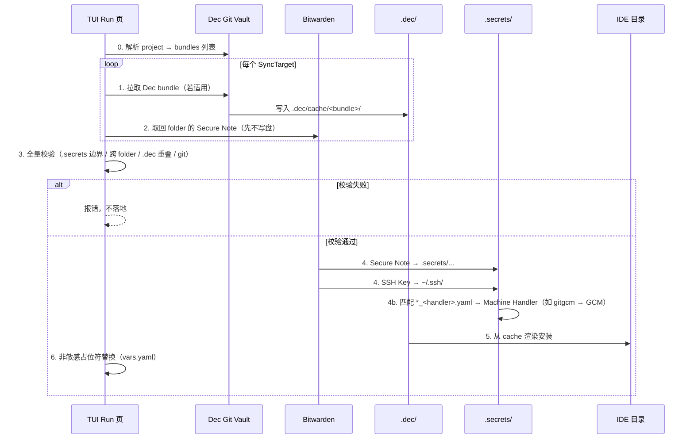

# Bundle 同构与 Secrets Bundle 模型

> 落地路径的决策依据见 [decisions/0002](decisions/0002-secrets-synctarget-root.md)（取代 [0001](decisions/0001-secrets-landing-path.md)）：
> **SyncTarget 为唯一同步单位；Bitwarden folder ↔ 本地 `.secrets` 同步根；Note 名 = 相对该同步根的路径。**

本文档描述 Dec **Project / bundle** 与 Bitwarden **secrets bundle** 的同构组织方式、`.secrets` 同步根、拉取落地流程，以及零路径重叠 invariant。实现细节见 `Documents/ARCHITECTURE.md`；schema 声明见 `schema/dec/v1/` 与 `schema/secrets/v1/`。

## 一句话

Dec 以 **Project**（vault `projects/<name>.yaml`）声明启用哪些 **bundle**；公开 bundle 落地 **`.dec/`**，Bitwarden **同名 secrets bundle** 的 Secure Note 落地 **`.secrets/`** 下对应同步根，SSH Key 落地 **机器级 `~/.ssh/`**。一次 TUI pull 按 project 的 bundle 列表分别写入各平面，**不合并进 `.dec/cache/`**，且 **`.dec/` 树与 `.secrets/` 树不得相交**。

## 存储根路径分离（核心）

| 平面 | 存储根 | 内容性质 | 组织单位 |
|------|--------|----------|----------|
| Dec Project 声明 | Git Vault **`projects/`** | 公开、可共享 | **project**（bundles 列表） |
| Dec（非敏感） | 项目 **`.dec/`** | 公开、可共享 | **bundle**（`cache/<name>/`） |
| Bitwarden（敏感） | 项目 **`.secrets/`** 或 **`~/.ssh/`** | 全部私密 | **SyncTarget**（bundle / project 级） |

- **Project**：vault `projects/<name>.yaml` 声明 `bundles`；本地 `.dec/config.yaml` 以 `project_name` 引用。
- **非敏感（Dec）**：仅在 `.dec/` 下（`cache/`、`config.yaml` 等）；渲染后部署到 IDE 目录如 `.cursor/`。
- **敏感（Bitwarden）**：Secure Note 落在 **`.secrets/project/`** 或 **`.secrets/bundles/<name>/`**；**SSH Key 例外**，落地机器级 `~/.ssh/`。
- 两者 **同构**（bundle 组织、子目录 + 文件），但 **存储根完全不同**。
- **零路径重叠**：`.dec/` 树与 `.secrets/` 树不得相交（SSH 在 `~/.ssh/`，不参与此项校验）。

```text
Git Vault                         本地工作区                         Bitwarden
─────────                         ──────────                         ─────────
projects/my-app.yaml              my-app/
  bundles: [vikunja]                ├── .dec/
                                    │   ├── config.yaml  project_name: my-app
bundles/vikunja/                    │   └── cache/vikunja/
  skills/...                        ├── .secrets/
                                    │   └── bundles/vikunja/
                                    │       └── env/vikunja.env
                                    └── .cursor/
                                        ↑ folder vikunja
                                          note "env/vikunja.env"
```

## SyncTarget 模型

**SyncTarget** 是一次 secrets 同步的单位：

```text
SyncTarget{kind: bundle, name: vikunja}
  folder: bundle/vikunja（默认带 bundle/ 前缀）
  LocalRoot: .secrets/bundles/vikunja
  note "env/vikunja.env" → <project>/.secrets/bundles/vikunja/env/vikunja.env

SyncTarget{kind: project, name: my-app}
  folder: my-app（默认同 project_name）
  LocalRoot: .secrets/project
  note "config/private.yaml" → <project>/.secrets/project/config/private.yaml
```

- **Bitwarden folder** 默认严格同名；显式别名见 `BundleBinding`（`dec_bundle` ↔ `secrets_bundle`）。
- **已删除** `vikunja → vikunja_workflow` 硬编码；历史别名由用户手工整理或显式 binding。
- **Note 名** = 相对 `SyncTarget.LocalRoot` 的路径（不是项目根路径）。
- **`.secrets/` 整树** 必须被 `.gitignore` 忽略；已被 git 跟踪则 pull/push **硬失败**。

## Project 与 Bundle 的关系

```text
Project（projects/my-app.yaml）          Bundle（bundles/vikunja/）
──────────────────────────────          ─────────────────────────
name: my-app                              skills/vikunja-workflow/
bundles:                                  rules/vikunja-integration.mdc
  - vikunja          ──pull 时展开──►     mcp/vikunja-mcp.json
  - helloworld                            bundle.yaml（可选元数据）

Pull 顺序：
  1. 解析 project_name → projects/<name>.yaml → bundles 列表
  2. 对每个 bundle：Dec Git → .dec/cache/<bundle>/ + Bitwarden → .secrets/bundles/<bundle>/
  3. 若有 project_name：额外同步 project 级 folder → .secrets/project/
```

- **Project** 只声明 bundle 短名；bundle 内资产结构在 `bundles/<name>/` 目录。
- 本地 `enabled_bundles` 从 vault project 同步；**Bundles** 页可微调后保存。
- secrets bundle **仍与 Dec bundle 一一绑定**，不由 project 单独声明。
- **project 级 secrets** 与 bundle 级并列，存放项目专属敏感文件。

## Project 级 secrets

除 bundle 绑定的 secrets 外，每个 project 可有 **project 级** 敏感文件：

```text
Bitwarden folder: bundle/vikunja          # bundle 级（前缀区分 project）
  note "env/vikunja.env"  →  .secrets/bundles/vikunja/env/vikunja.env

Bitwarden folder: my-app                  # project 级（project_name 或 project_secrets）
  note "config/private.yaml"  →  .secrets/project/config/private.yaml
```

| 维度 | bundle 级 | project 级 |
|------|-----------|------------|
| 触发条件 | **并集**：当前 project 的 `enabled_bundles` **或** 本机用户级启用列表（见 [0003](decisions/0003-user-enabled-secret-bundles.md)） | 有 `project_name`（或目录 basename） |
| Bitwarden folder | `secrets_bundle`（默认 `bundle/<name>`） | `project_secrets`（默认同 `project_name`） |
| 本地同步根 | `.secrets/bundles/<bundle>/` | `.secrets/project/` |
| Secure Note 名 | 相对同步根的路径 | 相对同步根的路径 |
| SSH Key | 一律 `~/.ssh/`（机器平面；可用户级单独启用纯 SSH bundle） | 不经 project folder 拉 SSH 时无此项 |

用户级启用：**不**新增 `user/` folder 协议；TUI **Settings** 勾选本机始终启用的 **Dec bundle**（公开资产 ∪ 对应 secrets），字段 `user_enabled_bundles` 落在 `~/.dec/secrets/`（语义是 bundle 短名，不是「仅 secrets」）。与各 project 的 `enabled_bundles` 做并集。secrets-only 在**勾选启用并保存**时才创建 vault `bundles/<name>/` 最小占位；仅发现时只进 `known_secret_bundles`。详情见 [0003](decisions/0003-user-enabled-secret-bundles.md)。

`known_secret_bundles` 是本机发现缓存（Settings 加载枚举 / pull 发现有密钥内容后写入），用于下次打开 Settings 或按 `r` 刷新时仍能看到名字；**不等于**启用，发现时也**不**写入 Dec Git vault。

`~/.dec/secrets/config.yaml` 示例：

```yaml
project_secrets: my-app   # 可选；未设时回退 .dec/config.yaml 的 project_name
# 用户级启用（ADR 0003）：
# user_enabled_bundles:
#   - woa
#   - woa
bundles:
  - dec_bundle: vikunja
    secrets_bundle: custom_alias   # 可选；默认同名（folder 为 bundle/<name> 或显式值）
```

**跨 folder 撞车**：两个 folder 的 note 汇总后映射到同一项目根相对路径时，pull 在写盘前报错并中止。

## 组织形式

Dec Git Vault 与 Bitwarden secrets bundle 在 **bundle 内** 使用相同的相对目录约定（`skills/`、`rules/`、`mcp/` 等），但各自映射到 **不同的存储根**：

```text
Dec Git Vault（bundle: vikunja）
bundles/vikunja/
  skills/vikunja-workflow/SKILL.md
  mcp/vikunja-mcp.json             # 无 token；运行时经 dec-exec 注入 env
  rules/vikunja-integration.mdc

Bitwarden folder: vikunja
  Secure Note 名 = 相对 .secrets/bundles/vikunja 的路径
  → env/vikunja.env
  内容为 dotenv：
    VIKUNJA_URL=https://vikunja.example.com
    VIKUNJA_API_TOKEN=...
```

### Bitwarden Secure Note 命名

- **Note 名称** = 相对 **SyncTarget.LocalRoot** 的路径（如 `env/vikunja.env`、`config/private.yaml`）。
- **Note 内容** = 该路径文件的完整正文。
- Pull 写到 `<project>/<LocalRoot>/<note 名>`；**不经过 `.dec/cache/`**。
- Push **递归扫描** `LocalRoot`（create/update）；**不隐式删除**远端 note。
- 远端有、本地缺的路径记入 `MissingLocal` 报告；**删除只走 Remote 页**。
- 新增 secret 走 TUI Project 页 `A`（登记 `.secrets/` 下已存在的文件）。

Note 名来自远端，按不可信输入处理：绝对路径、`~` 展开、`..` 逃逸、盘符一律拒绝；落进 `.dec/`、经符号链接逃出项目根、或已被 git 跟踪同样拒绝。校验在写任何文件**之前**完成。

## 环境变量与 `dec-exec`

- 环境变量 **只认** `env/*.env`（dotenv，单行标量 `KEY=value`）。
- 独立程序 **`dec-exec --bundle <name> -- <cmd>`** 按 bundle 作用域合并 `env/*.env` 后启动子进程；第三方 MCP 配置 `command: dec-exec`、`args: ["--bundle", "vikunja", "--", ...]`。
- **不再**依赖 mise / 外部 env 启动器把密文部署到 `.config/mise/`。
- `{{VAR_NAME}}` 占位符仍可用于 `.dec/vars.yaml` 驱动的 **非敏感** 模板变量，与 Bitwarden secrets 无关。

## SSH Key

OpenSSH、Git、`ssh`/`scp` 等工具默认只读取 **机器级** `~/.ssh/`。SSH 私钥 **不进 `.secrets/`**，Pull 后落地到用户主目录 `~/.ssh/`。

> **模型**：SSH 属于有限源类型 `ssh_item` 的默认处理；结构化机器副作用见 [0005 Machine Handlers](decisions/0005-secrets-machine-handlers.md)。

### Bitwarden SSH Key Item

| 字段 | 含义 |
|------|------|
| **Name** | 逻辑名（如 `deploy`） |
| **Notes** | 关联 host，**可选**；有内容时**一行一个** `host` 或 `host:port` |
| 私钥 / 公钥 | Bitwarden SSH Key Item 自带字段 |

Item 存放在与 Dec bundle 绑定的 Bitwarden folder（默认 `bundle/<name>`）。  
纯 SSH、跨项目复用的包（如 `bundle/woa`）应走 **用户级启用**，不必写入各 project 的 `enabled_bundles`（[0003](decisions/0003-user-enabled-secret-bundles.md)）。

### Pull 落地

| 产物 | 路径 |
|------|------|
| 私钥 | `~/.ssh/dec_<bundle>_<name>` |
| 公钥 | `~/.ssh/dec_<bundle>_<name>.pub` |
| SSH config | `~/.ssh/config.d/dec.conf`（主 `~/.ssh/config` 顶部 `Include`） |

### 目录示例

```text
# Bitwarden folder: vikunja
[SSH Key] deploy  Notes: vikunja.example.com

# Pull 后
my-app/.secrets/bundles/vikunja/env/vikunja.env
~/.ssh/dec_vikunja_deploy
~/.ssh/dec_vikunja_deploy.pub
```

## Machine Handlers（0005）

除默认落盘 / 默认 SSH 外，可用 **结构化处理器 Note** 写入机器平面副作用：

| 约定 | 说明 |
|------|------|
| 源类型 | 有限：`note` / `ssh_item` |
| Handler | 按名字开放注册；首个内置 `gitgcm` |
| Note 名 | `{实例}_{处理器}.yaml`（路由看 basename） |
| 正文 | YAML，且 `kind` 必须等于处理器名 |

例：Bitwarden note `cnb_gitgcm.yaml`：

```yaml
kind: gitgcm
host: cnb.cool
username: cnb
password: "<token>"
# protocol: https
# provider: generic
```

Pull：先写入同步根（机器级见 0007：`~/.dec/secrets/bundles/cnb/`），再 `git config` + `git credential approve`。  
普通 `env/*.env` **不**走 Handler。详见 [0005](decisions/0005-secrets-machine-handlers.md)、[0007](decisions/0007-machine-secrets-root.md)。

## 机器级 secrets 根与项目覆盖（0007）

| 启用 | 本地根 | Bitwarden |
|------|--------|-----------|
| 仅 user | `~/.dec/secrets/bundles/<name>/` | `bundle/<name>` |
| 仅 project | `<project>/.secrets/bundles/<name>/` | `bundle/<name>` |
| 两者都有 | 机器默认同上；覆盖：`<project>/.secrets/bundles/<name>/` | 默认 `bundle/<name>`；覆盖在**项目 folder**，Note 名 `bundles/<name>/...` |

`dec-exec` 合并：机器 env → 项目 bundle env → `.secrets/project/env`（后者同 key 覆盖）。

## 零重叠 Invariant

校验对象是 **两个存储根下的路径集合**：

- `.dec/` 树内所有相对路径
- `.secrets/` 树内所有相对路径（含 `project/`、`bundles/<name>/`）

规则：

- 上述两集合 **不得相交**（路径中含 `/.dec/` 的 secrets 路径同样拒绝）。
- 若 pull 检测到交集，**必须报错并中止**。
- `.secrets/` 必须被 `.gitignore` 覆盖。

## Pull 流程

用户在 TUI **Run** 页执行一次 **pull bundle**（或等价 API），内部顺序固定：



Pull **不做清理**：停用 bundle 后已落地的 `.secrets/` 文件原样保留，删除走 Remote 页。

Push：Dec 公开资产走 Git push（源为 `.dec/cache/`）；secrets 走 Bitwarden API（扫描 `.secrets/` 同步根），**不** 混入 Git Vault。

## TUI 用户体验

| 场景 | 用户操作 | 系统行为 |
|------|----------|----------|
| 首次进入工作区 | Home 初始化 project | 匹配/选择 vault project，同步 bundles |
| 首次启用 bundle | Bundles 页调整 → Run 页 pull | 一次完成 Dec + secrets 双边拉取 |
| 仅更新公开资产 | Run 页 pull | 仍尝试同步 secrets（幂等） |
| 路径冲突 | Run 页 pull | 整体失败，不部分安装 |
| Bitwarden 未配置 | Run 页 pull | 仅拉 Dec bundle |
| Secrets 管理 | Settings 页 | Bitwarden 连接、folder 绑定 |
| 新增一条 secret | Project 页 `A` | 登记 `.secrets/` 下已有文件 |
| 删除 / 编辑 secret | Remote 页 | 删除二次确认；`e` 外部编辑 Note / SSH Hosts |
| MCP 运行时注入 | `dec-exec`（独立程序） | 按 bundle 合并 `env/*.env` 后启动子进程 |

不在 TUI 外暴露 `dec secrets pull` 等独立子命令；与 [TUI 优先](../.cursor/rules/tui-first.mdc) 一致。

## Bitwarden 认证

拉取 secrets bundle 需要有效的 Bitwarden session。认证由 **`dec-server` 进程内**触发，TUI / MCP 门面共享该服务进程内的 session；**无独立 CLI 子命令**。

### Session 存储

| 规则 | 说明 |
|------|------|
| 仅存进程内存 | session **仅在当前 `dec-server` 进程**中保存 |
| 禁止落盘 | 无 `~/.dec/secrets/session`、无 `BW_SESSION` 文件缓存 |
| 进程内复用 | 同一进程内已有有效 session 则直接复用 |
| 无缓存则阻塞 | 无 session 时 web unlock，成功后写入进程内存 |

`~/.dec/secrets/` 下只有 `config.yaml` 与 `device.json`（deviceIdentifier + 2FA remember），**都不含** session。

### Web Unlock 流程（唯一认证入口）

1. 启动 `127.0.0.1` 本地 HTTP 服务（随机端口）
2. 打开系统浏览器到解锁页
3. 用户输入主密码；若需 2FA，同一页继续
4. 成功后 session 写入进程内存，关闭 HTTP 服务，继续 pull

详见 [ARCHITECTURE.md](./ARCHITECTURE.md) 与 [.cursor/rules/bitwarden-auth.mdc](../.cursor/rules/bitwarden-auth.mdc)。

## 配置与绑定

- **Project 声明**：vault `projects/<name>.yaml` 的 `bundles`；本地 `.dec/config.yaml` 的 `project_name`
- **Dec bundle 启用**：本地 `enabled_bundles`（Bundles 页保存）；secrets folder 默认 **同名**
- 显式绑定：`schema/secrets/v1/config.proto` 的 `BundleBinding`
- **无本地同步状态文件**：权威索引是远端 folder 的 note 列表 + push 时本地 `LocalRoot` 扫描

## Schema

- Project 声明：`schema/dec/v1/projects.proto`
- Dec bundle 声明：`schema/dec/v1/assets.proto`
- 本地项目引用：`schema/dec/v1/config.proto`
- Secrets 绑定：`schema/secrets/v1/config.proto`（`BundleBinding`）

## 相关文档

- [decisions/0002-secrets-synctarget-root.md](decisions/0002-secrets-synctarget-root.md) — ADR
- [ARCHITECTURE.md](./ARCHITECTURE.md) — 模块划分与端到端示例
- [.cursor/rules/bitwarden-auth.mdc](../.cursor/rules/bitwarden-auth.mdc)
- [.cursor/rules/bundle-secrets-mirror.mdc](../.cursor/rules/bundle-secrets-mirror.mdc)
- [schema/secrets/v1/README.md](../schema/secrets/v1/README.md)
