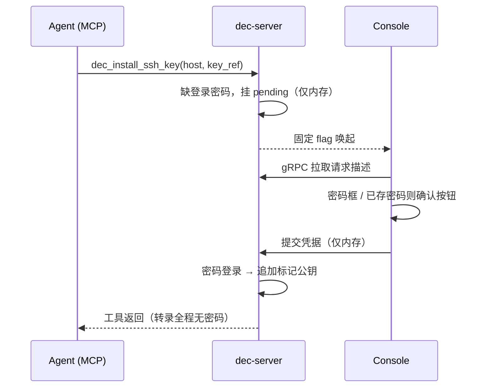

# 0036 — SSH 凭证生命周期与凭据请求通道

- **状态**：已接受（草案）
- **日期**：2026-09-27
- **关联**：[0004](0004-remote-page.md)、[0016](0016-p-four-quadrant-model.md)、[0019](0019-remote-provisioning.md)、[0022](0022-console-bitwarden-unlock.md)、[0030](0030-agent-tools-thin-shell.md)、[0034](0034-bw-belonging-annotation.md)、[0035](0035-product-secrets-plane-declaration.md)
- **影响范围**：`internal/secrets`（生成 / 导入 / 材料）、`internal/agenttools`（新工具面）、`internal/servicehost`（凭据请求 pending 状态）、Console（凭据请求 UI）、[ARCHITECTURE.md](../ARCHITECTURE.md) 服务器侧边界条款

## 问题

Agent 接手 SSH 凭证的三类场景（存量导入、密码引导新建、更换）目前全部缺链路：

1. **生命周期原语未对 agent 开放**。`internal/secrets` 已有 `CreateSSHKey`（支持导入材料并校验）、`GenerateSSHKeyMaterial`、`UpdateSSHKeyHosts` 等原语，但 `dec-mcp` 只有 `dec_list_secrets` / `dec_delete` 能碰到 SSH Key；生成、导入、安装到远端都无对应工具。
2. **密码引导不存在**。0019 置备要求 key auth 先成立（`BatchMode=yes`），"内网裸机只有密码"的场景缺 ssh-copy-id 等价物，永远进不了置备链路。
3. **敏感凭据没有交互通道**。登录密码、私钥口令走 MCP 参数或 agent askquestion 都会进对话转录，泄露面不可接受。
4. **设备凭证归属悬空**。设备 SSH Key / 密码不属于"当前操作的项目"，落无主 folder 违反 0016 的归属轴（folder = 项目名）。
5. **服务器侧边界过时**。"Dec 不管理 authorized_keys"写于 pull / landing 时代，当时写作用域只有本机 `~/.ssh`、GCM、`.env`；0019 置备事实上已跨过该边界（推二进制、写远端 `config.yaml`），密码引导更是必然要写 authorized_keys。

## 决策

### 1. 凭据请求通道：0022 模式的泛化

需要人工提供敏感凭据时，密码 / 口令 / 私钥材料**不走 MCP 参数，也不走 agent askquestion**，走 dec-server 内存挂起的凭据请求：

- 工具调用触发缺失凭据 → `dec-server` 内存挂 pending 请求（描述需要什么：主机 X 的登录密码 / 私钥口令 / 私钥材料），调用阻塞；
- Console 被固定 flag 唤起（沿用 0022 的 argv 不带业务参数原则），经 gRPC 拉取请求描述，按类型渲染控件：密码输入框、私钥粘贴框、文件选择、确认按钮；
- 若 BW 同步根已有对应条目（设备密码 Secure Note），自动填充，GUI 只剩确认（严格模式）；
- 用户提交 → 内存态继续执行 → 工具返回。凭据不进 MCP 参数、不进转录、不进日志；
- headless（无 GUI 前台）按 0022 结构化错误模式拒绝并说明原因，不静默挂死。

### 2. Agent 工具面（agenttools 层新增）

- `dec_generate_sshkey`：本机 ssh-keygen 生成 → 建 BW item → pull 落地 → 返回公钥 + 指纹（只回可安全展示的部分）。
- `dec_import_sshkey`：参数只收 `private_key_path`（文件路径），私钥材料永不进 MCP 参数与转录；带口令私钥的口令经凭据请求通道采集。
- `dec_install_ssh_key`：密码引导安装——生成 / 指定公钥 → 凭据请求通道拿登录密码 → 密码登录一次 → 追加标记公钥到 `authorized_keys` → 之后复用 `dec_provision_remote`。

### 3. authorized_keys 标记化受限管理（修订 0019 时代的边界）

边界从"Dec 不管理服务器侧"改为"**Dec 只管理自己写入的 authorized_keys 条目**"：

- Dec 追加的每行公钥带标记注释 `# dec:<alias>`；
- 安装 / 更换只增删带标记的行，永不触碰人工维护的条目；
- 首次写远端 authorized_keys 与置备同级：typed confirm（键入主机名确认）；
- 更换走两阶段：追加新钥 → 用新钥 probe 验证通过 → 再删旧标记行；验证不过停在双钥并存，宁可留旧钥不失联。

### 4. 设备凭证归属：挂产品，落 global 平面

归属轴（folder = 产品名）与落点轴（`private/global` | `private/local`）分开，0016 / 0034 / 0035 的模型一行不动：

- 设备 SSH Key 挂拥有它的产品的 `private/global` 平面（如 `woa`、`tencent-cloud` 的 `.sshkey` 条目），产品声明 `secrets_plane: global`——平面由提供者声明（0035 原则），使用者侧只校验、不决定；
- 设备密码是同产品 target 下的 Secure Note：路径 `.password/<alias>`（如 `woa/private/global/.password/dev-box`），正文两行 `username: <u>` / `password: 
`，凭据请求通道按该地址自动填充。`.password` 注册为独立点类型（`ParseTypePath` 对未知点目录硬失败，不注册则同步 / 迁移链路直接拒绝该条目），但不提供 temp / path / picker 手输来源、不进 Remote 登记表单——条目由工具经凭据请求通道写入，人不手输；pull 语义与其他 note 一致，随产品 folder 同步落本机 secrets 根（`.env` / `.gcm` 同理），不另设"永不落盘"特例；
- 一次性杂机在个人产品仓挂身份型产品兜底（如 DecPersonalDevKit 下 `devices`，`provides` 为空、只发身份），不开无主 folder——无主 folder 会被 0034 孤儿判读折叠进"疑似孤儿"，本就不是设计欢迎的形态；
- `GlobalConfig.managed_devices`（0019）分工不变：只存连接状态（别名、SSH 目标引用、监听地址、置备版本），不存凭证正文，引用指向产品 folder 条目；
- registry 快照只携带声明（`provider.yaml` 的 `secrets_plane` 等），凭证正文只进 BW，注册仓不存具体信息的原则不变。

### 5. v1 范围与 passphrase

- **rotate 工具 v1 不做**（BW 侧原地 ReplaceMaterial 缺方法，Delete+Create 会丢 hosts 且走 trash 语义），但标记机制在 install 时即埋入，rotate 以后接上是顺手的事；
- **带 passphrase 私钥支持导入，入库去口令**：加密层已由 BW 承担，私钥再加一层口令没有安全增量，只会破坏 BatchMode 等下游非交互链路。口令经凭据请求通道采集，`ssh-keygen -y` 校验后去口令入库；Console 确认文案明示"口令被去除、材料以库加密为唯一保护"。

## 被否方案

- **密码走 MCP 参数或 agent askquestion**：进对话转录，泄露面不可接受（askquestion 由用户明确否决）。
- **SSH_ASKPASS 环境变量路由**：实现比 GUI 通道更绕，headless 无兜底，且只覆盖 SSH 密码一种类型，覆盖不了私钥材料 / 文件选择。被否的是「拿 ASKPASS 当用户到 dec-server 的交互通道」；dec-server 进程内部把 GUI 已收到的密码喂给 ssh 子进程（ASKPASS / pty 均可）是实现细节，不在此否决范围内。
- **设备凭证落无主 `private/global` folder**：违反 0016 归属轴（folder = 项目名），0034 孤儿判读会把无主 folder 折进"疑似孤儿"。
- **rotate 全链路 v1 一起做**：两阶段远端换钥依赖标记机制先在存量设备上铺开，v1 只有新建场景，先埋标记即可。
- **拒绝带 passphrase 私钥**：加密层已由 BW 承担，二次加密无安全增量，只破坏非交互链路（BatchMode 必挂）。
- **全量服务器侧管理（触碰人工条目）**：作用域失控，回到"边界形同虚设"的老问题。

## 实现要点

1. `internal/secrets`：`GenerateSSHKeyMaterial` / `CreateSSHKey` 复用；导入校验链路对带口令私钥增加口令参数分支；processor 表注册 `.password` 点类型（无手输来源，正文两行 username / password）。
2. `internal/agenttools`：三个新工具进清单（0030 薄壳模式，`plan.go` 编排下移不变）。
3. `internal/servicehost`：pending credential request 内存态 + Console 唤起 flag + 超时清理。
4. Console：凭据请求页（密码框 / 口令框 / 私钥粘贴 / 文件选择 / 确认按钮），复用 0022 的唤起与提交链路。
5. 文档改平：[ARCHITECTURE.md](../ARCHITECTURE.md) 服务器侧边界条款按本决策修订。
